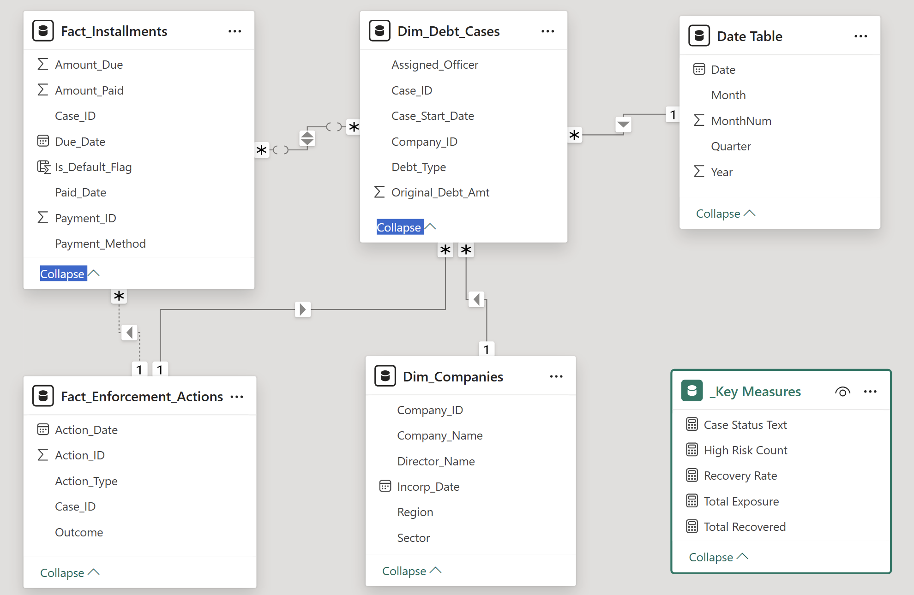
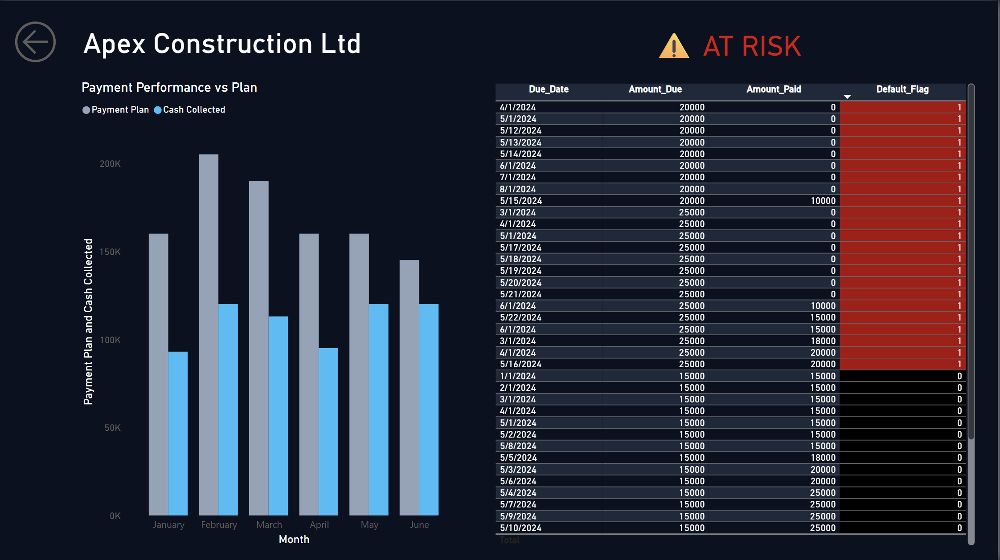

# 🏛️ HMRC Debt Recovery Intelligence Hub: A Risk Enforcement Engine

| Tech Stack | Methodology | Project Status |
| :--- | :--- | :--- |
|    | Star Schema, Agile | ✅ Completed (2025) |

> **Disclaimer:** This is a personal portfolio project using a synthetic dataset to demonstrate technical capabilities. It is a simulation of real-world public sector challenges and is not affiliated with His Majesty's Revenue and Customs.

---

## 🧭 Mission Directive

### 🎯 The Goal
To engineer a **"Single Pane of Glass" Enforcement System** that moves Debt Management from **Passive Reporting** (static Excel sheets) to **Active Intelligence**. The objective is to maximize the **Recovery Rate** by identifying "Spiraling Debt" patterns early and directing enforcement officers to high-value, high-risk targets.

### 📉 The Challenge
In the high-volume environment of UK Tax Collection, resources are finite. HMRC cannot investigate every missed payment manually. The department faced a "Blind Spot" crisis:
1.  **Inefficient Triage:** Officers wasted hours analyzing low-value cases instead of focusing on habitual defaulters.
2.  **Sector Blindness:** Inability to visualize which industries (e.g., Construction) were driving the bulk of the £1M debt pile.
3.  **Slow Reaction Time:** Detecting "Spiraling Debt" (consecutive missed payments) often took months using legacy tools.
---

## 📑 Table of Contents
1.  [Executive Summary & Impact](#1-executive-summary--impact)
2.  [Key Business Questions Solved](#2-key-business-questions-solved)
3.  [Data Structure (Star Schema)](#3-data-structure-star-schema)
4.  [Dashboard Deep Dive](#4-dashboard-deep-dive)
5.  [UI/UX Design Philosophy](#-uiux-design-philosophy)
6.  [Strategic Recommendations](#5-strategic-recommendations)
7.  [Assumptions & Future Scope](#6-assumptions--future-scope)
8.  [Technical Implementation](#7-technical-implementation)
9.  [Data Dictionary](#8-data-dictionary)

---

## 🏆 Executive Summary & Quantified Impact

This solution functions as an automated risk segmentation engine, transforming raw ledger data into a strategic enforcement tool.

**Quantified Impact:**
*   **Portfolio Oversight:** Monitors a total active debt exposure of **£1M+**, providing real-time liquidity tracking across multiple regions.
*   **Risk Identification:** Automatically flagged **23 "High Risk" Habitual Defaulters** using complex behavioral logic, creating an immediate "Hit List" for legal action.
*   **Operational Efficiency:** Reduced case investigation time from **hours to seconds** via a forensic 3-click drill-through workflow.
*   **Collection Performance:** Tracks a current **Recovery Rate of 65%**, highlighting a significant gap against the 85% departmental target and pinpointing underperforming sectors (specifically Construction).

---

## 2. Key Business Questions Solved

| Stakeholder | Question | Solution |
| :--- | :--- | :--- |
| **Risk Director** | "Where is the debt accumulating?" | **Waterfall Chart** identifies Construction as the dominant risk sector. |
| **Case Officer** | "Who requires immediate legal action?" | **Risk Matrix** flags companies with Red Diamond icons (2+ defaults). |
| **Ops Manager** | "How efficient is our collection?" | **Recovery Rate KPI** (currently 65%) tracks collection vs. due amounts. |
| **Forensic Analyst** | "When did the insolvency begin?" | **Drill-Through Case File** visualizes the exact month payments stopped. |

---

## 3. Data Structure (Star Schema)
To ensure high performance and accurate filtering, the data model was architected as a robust **Star Schema**.

*   **Fact Table:** `Fact_Installments`
    *   Granular transaction logs (Due Date, Amount Paid, Payment Method).
    *   Contains the core `Is_Default_Flag` logic.
*   **Dimension Tables:**
    *   `Dim_Companies`: Sector, Region, Director Names.
    *   `Dim_Debt_Cases`: Case start dates and assigned officers.
    *   `Date Table`: Standard calendar for time-intelligence calculations.
*   **Relationships:** Strict **One-to-Many (1:*)** relationships flowing from Dimensions to the Fact table.

---

## 4. Dashboard Deep Dive

The solution is architected around a specific operational workflow: **Detect (Page 1) $\rightarrow$ Investigate (Page 2).**

### 1️⃣ Page 1: The Command Center (The Cockpit)
*Designed for Senior Risk Officers, this view eliminates noise and focuses strictly on "Exception-Based Reporting."*

#### **A. The Heads-Up Display (Strategic KPIs)**
Top-level metrics provide an immediate health check of the £1M portfolio using "Glassmorphism" cards to separate high-level data from detailed analytics.
*   **Total Exposure (£1M):** Represents the total liability (Amount Due). This acts as the denominator for all risk calculations.
*   **Recovery Rate (65%):** The primary efficiency KPI (`Total Collected / Total Due`). A rate below 85% triggers a strategic review.
*   **High Risk Count (23):** The operational workload. This tells the officer there are exactly 23 companies requiring immediate intervention.
*   **Total Recovered (£661K):** The realized cash flow. This is the "Bankable" success metric.

#### **B. The Strategy Bridge (Waterfall Chart)**
**"Risk Concentration by Sector"**
Instead of a standard bar chart, a Waterfall chart was selected to show the **cumulative impact** of each sector on the total debt pile.
*   *Forensic Insight:* The chart clearly isolates **Construction** as the dominant risk factor (the tallest bar). This insight directs the department to pivot resources toward Construction sector audits.

#### **C. The Risk Matrix (The "Hit List")**
This table is the engine of the dashboard. It moves beyond standard reporting by combining financial data with visual risk indicators.
*   **Total Exposure (Data Bars):** Blue bars visualize the magnitude of debt relative to others. This allows users to spot "High Value" targets instantly without reading numbers.
*   **Recovery Rate:** Highlights collection efficiency per company.
*   **Risk Status (Conditional Icons):**
    *   ♦️ **Red Diamond (High Risk):** Triggered when `Default Count >= 1`. These companies have missed payments and require legal escalation.
    *   🟢 **Green Circle (Compliant):** Triggered when `Default Count = 0`. These companies are monitoring-only.

---

### 2️⃣ Page 2: The Case File (Forensic Drill-Through)
*This is a hidden page, accessible only via a specific user action. It acts as the "Digital Dossier" for a specific company.*

#### **The Drill-Through Workflow**
To access this page, the user must:
1.  Identify a **Red Diamond** target on Page 1.
2.  **Right-Click** the company name $\rightarrow$ Select **Drill Through**.
3.  *Result:* The dashboard passes the specific `Company_ID` filter to Page 2, isolating that single entity's data.

#### **A. Dynamic Header & Alerting**
*   **Company Context:** The title automatically updates to the selected company (e.g., "Apex Construction Ltd").
*   **"⚠️ AT RISK" Warning:** A dynamic DAX measure evaluates the specific client's standing. If they meet the criteria for a Habitual Defaulter, this large red warning appears to alert the case officer immediately.

#### **B. Variance Analysis (Payment vs. Plan)**
**"Payment Performance vs Plan"** (Clustered Column Chart)
This visual reconstructs the timeline of insolvency.
*   **Grey Columns (Payment Plan):** Represents the contractual obligation (What they *promised* to pay).
*   **Cyan Columns (Cash Collected):** Represents the actual inflow (What they *actually* paid).
*   *Forensic Insight:* By comparing the two bars, an analyst can pinpoint the exact month the company stopped paying (e.g., Seeing a Grey bar with no corresponding Cyan bar in April).

#### **C. The Transaction Log (The Evidence)**
A granular, line-by-line table listing every invoice issued to the company.
*   **Conditional Formatting:** Any row where `Is_Default_Flag = 1` is highlighted in **Red**.
*   **Operational Use Case:** This table serves as the legal evidence trail. Officers can export this specific view to PDF/Excel to attach to "Letter Before Action" enforcement notices.

#### **D. The "Escape Hatch" (Back Button)**
Located in the top-left corner. Because this is a drill-through page, the Back Button is crucial for UX, allowing the user to clear the filters and return to the Command Center to investigate the next target.

---

## 5. Strategic Recommendations
Based on the data analysis, the following actions are recommended:

1.  **Sector Pivot:** Shift 40% of enforcement resources to the **Construction** sector immediately, as it holds the highest concentration of debt.
2.  **Automated Triggers:** Implement an email alert when a company hits "Amber" status (1 missed payment) to prevent them from spiraling into "Red" status.
3.  **Legal Prioritization:** The 23 companies identified in the "High Risk Count" KPI should be fast-tracked for legal review.

---

## 6. Assumptions & Future Scope
*   **Assumptions:** Data assumes a standard fiscal year. A "Default" is defined as any payment less than the amount due by the cutoff date.
*   **Future Scope:**
    *   Integration of Python scripts for predictive modeling (forecasting future defaults).
    *   "Director View" to track serial offenders across multiple limited companies.

---

## 7. Technical Implementation

### SQL Transformation (The "Brain")
Raw data was pre-processed using **SQL Server** to ensure logic resides in the backend.
*   **Window Functions (`LAG`):** Used to detect "Spiraling" behavior by comparing current status to the previous month.
*   **Ranking (`DENSE_RANK`):** Used to categorize top offenders within their specific sectors.
*   **CTEs:** Used to clean nulls and structure the logic modularly.

---

## 8.📖 Data Dictionary

| Term | Definition | Logic Used |
| :--- | :--- | :--- |
| **Total Exposure** | The total monetary value of debt currently assigned for collection. | `SUM(Fact_Installments[Amount_Due])` |
| **Recovery Rate** | The efficiency metric showing the percentage of debt successfully collected. | `DIVIDE(Total Recovered, Total Exposure)` |
| **Habitual Defaulter** | A company flagged as high risk due to repeated missed payments. | `Default Count >= 2 (Triggers Red Diamond)` |
| **Spiraling Debt** | A behavioral pattern where a debtor misses consecutive payments, indicating insolvency. | `SQL LAG() Function (Current=1 AND Prev=1)` |
| **Default Flag** | Binary marker indicating a specific installment was less than the due amount. | `IF Amount_Paid < Amount_Due THEN 1 ELSE 0` |

---
*Author: [Sagar Chaandwani]*
